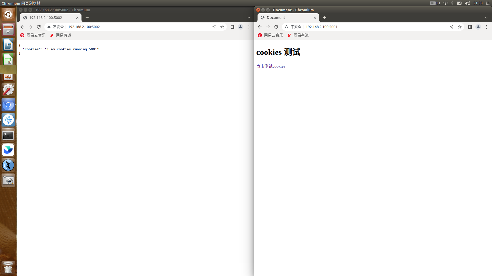

1. 起因

   在项目中，我们使用cookie搭配nginx的auth_request模块进行文件鉴权功能。

   恰好系统区分前后台模块，所以将业务前后台分别跑在一台服务器的不同端口上，通过nginx使用不同的端口进行转发。

2. 问题表现

    刚开始开发和部署测试时并没有发现异常，文件倒也是很正常的可以访问，直到有一次尝试预发布上线，老板尝试了两把，突然就出现了......

    具体表现就是：文件管理员上传的文件图片，一刷新就没办法看到了; 或者普通帐号可以明目张胆的看到了这个文件....


3. 问题排查

    3.1 检查文件访问时有没有正常携带cookie，检查也没有问题。

    3.2 检查nginx文件鉴权功能，检查到也是没有问题的。

    3.3 后端文件鉴权模块排查，....，没错，问题就出现在这里...

4. 解决过程

    在仔细排查之后发现，文件管理员的文件鉴权功能中发现，当前cookie解析出现的用户竟然是一个普通帐号，询问之后才发现，他上传文件之后，刷新时，文件确实有被正常获取并返回200。但是...老板不走常规路啊，他在后台登录管理员帐号之后，然后在前台又登录了一个普通帐号。心里想着说我自己发布一个文件，我在前台看看，可没想就是这个小动作，问题就出现了。管理员的cookie被普通用户的cookie覆盖掉了，刚好文件上传之后并没有被发布，导致无法看到这个文件详细了...当然反过来就是普通帐号竟然可以看到未发布的文件内容

    恩？按常理，浏览器的同源策略会导致跨域问题，从而导致不同端口的cookie是无法共享的啊？什么鬼。

    然后就去网上找相关的资料，然后找到这篇文章[HTTP State Management Mechanism](https://www.rfc-editor.org/rfc/rfc6265)，请定位到这里[https://www.rfc-editor.org/rfc/rfc6265#section-8.5](https://www.rfc-editor.org/rfc/rfc6265#section-8.5),内容如下：

    ```shell
    Cookies do not provide isolation by port.  If a cookie is readable by
    a service running on one port, the cookie is also readable by a
    service running on another port of the same server.  If a cookie is
    writable by a service on one port, the cookie is also writable by a
    service running on another port of the same server.  For this reason,
    servers SHOULD NOT both run mutually distrusting services on
    different ports of the same host and use cookies to store security-
    sensitive information.

    Cookies do not provide isolation by scheme.  Although most commonly
    used with the http and https schemes, the cookies for a given host
    might also be available to other schemes, such as ftp and gopher.
    Although this lack of isolation by scheme is most apparent in non-
    HTTP APIs that permit access to cookies (e.g., HTML's document.cookie
    API), the lack of isolation by scheme is actually present in
    requirements for processing cookies themselves (e.g., consider
    retrieving a URI with the gopher scheme via HTTP).

    Cookies do not always provide isolation by path.  Although the
    network-level protocol does not send cookies stored for one path to
    another, some user agents expose cookies via non-HTTP APIs, such as
    HTML's document.cookie API.  Because some of these user agents (e.g.,
    web browsers) do not isolate resources received from different paths,
    a resource retrieved from one path might be able to access cookies
    ```

    大意就是：cookie是不区分端口的....

5. 问题复现

    代码见当前目录下的`src`文件夹

    结果图:

    
    

6. 解决方案

    出现这个问题的原因是人为操作的异常，但是我们也尝试了简单的应急方案：使用cookie的path来处理，将cookie设置为严格模式。