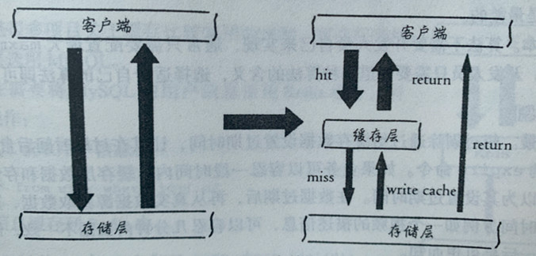
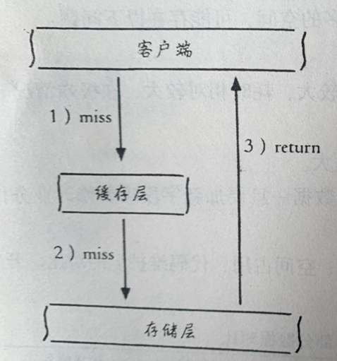
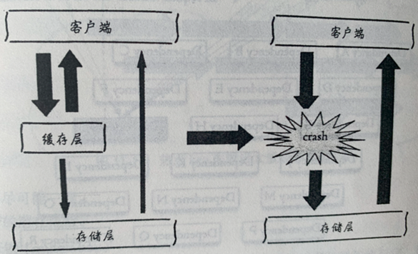

## 一、缓存的目的

加速读写，减少对后端数据库（比如MySQL、postgres）的负载

缓存更新策略

- LRU算法

    通过配置maxmemory-policy来实现数据的自动淘汰清除策略，维护成本较低，数据一致性差

- 超时剔除

    通过对数据设置超时，过期自动淘汰，数据一致性较差

- 主动更新

    在数据更新后，实时更新缓存，数据一致性较好

## 二、缓存常见问题

1. 缓存穿透

    描述：具体指查询一条不存在的数据，此时会穿过缓存直接打到数据库中。下一次查询请求时，还是会继续穿透缓存，直接打在数据库中。

    触发场景：一般业务存在漏洞或者恶意攻击、爬虫导致的大量的缓存穿透问题。

    

    解决方案：
    
    - 缓存空对象
    
        即对不存在的数据进行缓存，即使再次请求，我们就可以命中缓存。当然，这部分缓存最好设置一个过期时间，避免大量空对象一直存储在Redis中。

        适用场景：数据变化频率高

        缺点：可能在Redis中产生大量的空对象

    - 布隆过滤器

        即对存在的键配置在一个集合中，当查询请求过来时，直接判断当前请求键是否在集合中，如果在，继续请求缓存中的数据，否则直接返回空

        使用场景：数据相对固定

        缺点：代码维护相对较为复杂

2. 缓存雪崩

    描述: 具体指查询时，缓存层无法提供服务，或者数据全部失效，导致查询请求全部打到数据库上。

    触发场景：Redis服务不可用或者数据同一时刻都失效了

    

    解决方案：

    - 保证Redis缓存层服务的高可用

    - 通过一些组件对后端应用做限流

    - 对数据尽可能设置不同的过期时长

3. 缓存击穿

    描述：具体指查询时，缓存层的这个数据刚好失效，大量的查询请求直接打在了数据库服务上。

    触发场景：缓存的数据刚好过期

    解决方案：

    - 可以在业务允许的范围内，对数据做“永久”不过期配置

    - 使用互斥锁。如果缓存失效的情况，只有拿到锁才可以查询数据库，降低了在同一时刻打在数据库上的请求，数据的一致性较高，但也存在降低系统并发的风险。

