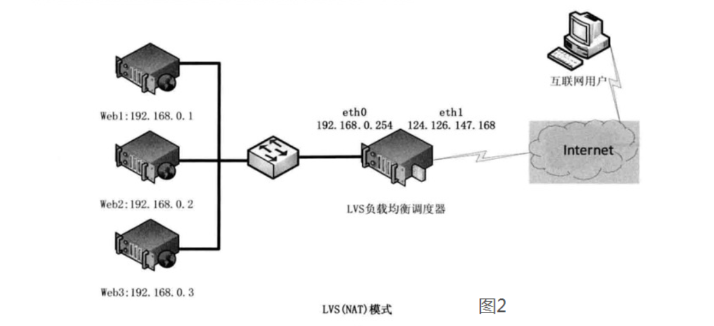
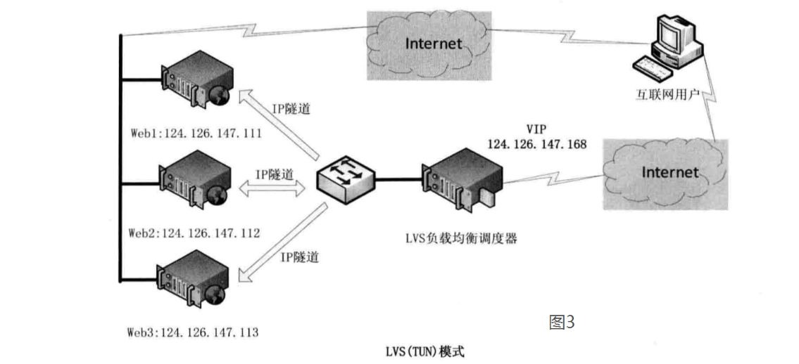

## 一、LVS简介

LVS（Linux Virtual Server）即Linux虚拟服务器，是由章文嵩博士主导的开源负载均衡项目，目前LVS已经被集成到Linux内核模块中。该项目在Linux内核中实现了基于IP的数据请求负载均衡调度方案，其体系结构如图1所示，终端互联网用户从外部访问公司的外部负载均衡服务器，终端用户的Web请求会发送给LVS调度器，调度器根据自己预设的算法决定将该请求发送给后端的某台Web服务器，比如，轮询算法可以将外部的请求平均分发给后端的所有服务器，终端用户访问LVS调度器虽然会被转发到后端真实的服务器，但如果真实服务器连接的是相同的存储，提供的服务也是相同的服务，最终用户不管是访问哪台真实服务器，得到的服务内容都是一样的，整个集群对用户而言都是透明的。最后根据LVS工作模式的不同，真实服务器会选择不同的方式将用户需要的数据发送到终端用户，LVS工作模式分为NAT模式、TUN模式、以及DR模式。

## 二、三种工作模式的解析。

### 1、基于NAT的LVS模式负载均衡

NAT（Network Address Translation）即网络地址转换，其作用是通过数据报头的修改，使得位于企业内部的私有IP地址可以访问外网，以及外部用用户可以访问位于公司内部的私有IP主机。VS/NAT工作模式拓扑结构如图2所示，LVS负载调度器可以使用两块网卡配置不同的IP地址，eth0设置为私钥IP与内部网络通过交换设备相互连接，eth1设备为外网IP与外部网络联通。

第一步，用户通过互联网DNS服务器解析到公司负载均衡设备上面的外网地址，相对于真实服务器而言，LVS外网IP又称VIP（Virtual IP Address），用户通过访问VIP，即可连接后端的真实服务器（Real Server），而这一切对用户而言都是透明的，用户以为自己访问的就是真实服务器，但他并不知道自己访问的VIP仅仅是一个调度器，也不清楚后端的真实服务器到底在哪里、有多少真实服务器。

第二步，用户将请求发送至124.126.147.168，此时LVS将根据预设的算法选择后端的一台真实服务器（192.168.0.1\~192.168.0.3），将数据请求包转发给真实服务器，并且在转发之前LVS会修改数据包中的目标地址以及目标端口，目标地址与目标端口将被修改为选出的真实服务器IP地址以及相应的端口。

第三步，真实的服务器将响应数据包返回给LVS调度器，调度器在得到响应的数据包后会将源地址和源端口修改为VIP及调度器相应的端口，修改完成后，由调度器将响应数据包发送回终端用户，另外，由于LVS调度器有一个连接Hash表，该表中会记录连接请求及转发信息，当同一个连接的下一个数据包发送给调度器时，从该Hash表中可以直接找到之前的连接记录，并根据记录信息选出相同的真实服务器及端口信息。

### 2、基于TUN的LVS负载均衡

在LVS（NAT）模式的集群环境中，由于所有的数据请求及响应的数据包都需要经过LVS调度器转发，如果后端服务器的数量大于10台，则调度器就会成为整个集群环境的瓶颈。我们知道，数据请求包往往远小于响应数据包的大小。因为响应数据包中包含有客户需要的具体数据，所以LVS（TUN）的思路就是将请求与响应数据分离，让调度器仅处理数据请求，而让真实服务器响应数据包直接返回给客户端。VS/TUN工作模式拓扑结构如图3所示。其中，IP隧道（IP tunning）是一种数据包封装技术，它可以将原始数据包封装并添加新的包头（内容包括新的源地址及端口、目标地址及端口），从而实现将一个目标为调度器的VIP地址的数据包封装，通过隧道转发给后端的真实服务器（Real Server），通过将客户端发往调度器的原始数据包封装，并在其基础上添加新的数据包头（修改目标地址为调度器选择出来的真实服务器的IP地址及对应端口），LVS（TUN）模式要求真实服务器可以直接与外部网络连接，真实服务器在收到请求数据包后直接给客户端主机响应数据。

### 3、基于DR的LVS负载均衡

在LVS（TUN）模式下，由于需要在LVS调度器与真实服务器之间创建隧道连接，这同样会增加服务器的负担。与LVS（TUN）类似，DR模式也叫直接路由模式，其体系结构如图4所示，该模式中LVS依然仅承担数据的入站请求以及根据算法选出合理的真实服务器，最终由后端真实服务器负责将响应数据包发送返回给客户端。与隧道模式不同的是，直接路由模式（DR模式）要求调度器与后端服务器必须在同一个局域网内，VIP地址需要在调度器与后端所有的服务器间共享，因为最终的真实服务器给客户端回应数据包时需要设置源IP为VIP地址，目标IP为客户端IP，这样客户端访问的是调度器的VIP地址，回应的源地址也依然是该VIP地址（真实服务器上的VIP），客户端是感觉不到后端服务器存在的。由于多台计算机都设置了同样一个VIP地址，所以在直接路由模式中要求调度器的VIP地址是对外可见的，客户端需要将请求数据包发送到调度器主机，而所有的真实服务器的VIP地址必须配置在Non-ARP的网络设备上，也就是该网络设备并不会向外广播自己的MAC及对应的IP地址，真实服务器的VIP对外界是不可见的，但真实服务器却可以接受目标地址VIP的网络请求，并在回应数据包时将源地址设置为该VIP地址。调度器根据算法在选出真实服务器后，在不修改数据报文的情况下，将数据帧的MAC地址修改为选出的真实服务器的MAC地址，通过交换机将该数据帧发给真实服务器。整个过程中，真实服务器的VIP不需要对外界可见。

## 三、LVS负载均衡调度算法

根据前面的介绍，我们了解了LVS的三种工作模式，但不管实际环境中采用的是哪种模式，调度算法进行调度的策略与算法都是LVS的核心技术，LVS在内核中主要实现了一下十种调度算法。

### 1.轮询调度

轮询调度（Round Robin 简称'RR'）算法就是按依次循环的方式将请求调度到不同的服务器上，该算法最大的特点就是实现简单。轮询算法假设所有的服务器处理请求的能力都一样的，调度器会将所有的请求平均分配给每个真实服务器。

### 2.加权轮询调度

加权轮询（Weight Round Robin 简称'WRR'）算法主要是对轮询算法的一种优化与补充，LVS会考虑每台服务器的性能，并给每台服务器添加一个权值，如果服务器A的权值为1，服务器B的权值为2，则调度器调度到服务器B的请求会是服务器A的两倍。权值越高的服务器，处理的请求越多。

### 3.最小连接调度

最小连接调度（Least Connections 简称'LC'）算法是把新的连接请求分配到当前连接数最小的服务器。最小连接调度是一种动态的调度算法，它通过服务器当前活跃的连接数来估计服务器的情况。调度器需要记录各个服务器已建立连接的数目，当一个请求被调度到某台服务器，其连接数加1；当连接中断或者超时，其连接数减1。

（集群系统的真实服务器具有相近的系统性能，采用最小连接调度算法可以比较好地均衡负载。)

### 4.加权最小连接调度

加权最少连接（Weight Least Connections 简称'WLC'）算法是最小连接调度的超集，各个服务器相应的权值表示其处理性能。服务器的缺省权值为1，系统管理员可以动态地设置服务器的权值。加权最小连接调度在调度新连接时尽可能使服务器的已建立连接数和其权值成比例。调度器可以自动问询真实服务器的负载情况，并动态地调整其权值。

### 5.基于局部的最少连接

基于局部的最少连接调度（Locality-Based Least Connections 简称'LBLC'）算法是针对请求报文的目标IP地址的 负载均衡调度，目前主要用于Cache集群系统，因为在Cache集群客户请求报文的目标IP地址是变化的。这里假设任何后端服务器都可以处理任一请求，算法的设计目标是在服务器的负载基本平衡情况下，将相同目标IP地址的请求调度到同一台服务器，来提高各台服务器的访问局部性和Cache命中率，从而提升整个集群系统的处理能力。LBLC调度算法先根据请求的目标IP地址找出该目标IP地址最近使用的服务器，若该服务器是可用的且没有超载，将请求发送到该服务器；若服务器不存在，或者该服务器超载且有服务器处于一半的工作负载，则使用'最少连接'的原则选出一个可用的服务器，将请求发送到服务器。

### 6.带复制的基于局部性的最少连接

带复制的基于局部性的最少连接（Locality-Based Least Connections with Replication  简称'LBLCR'）算法也是针对目标IP地址的负载均衡，目前主要用于Cache集群系统，它与LBLC算法不同之处是它要维护从一个目标IP地址到一组服务器的映射，而LBLC算法维护从一个目标IP地址到一台服务器的映射。按'最小连接'原则从该服务器组中选出一一台服务器，若服务器没有超载，将请求发送到该服务器；若服务器超载，则按'最小连接'原则从整个集群中选出一台服务器，将该服务器加入到这个服务器组中，将请求发送到该服务器。同时，当该服务器组有一段时间没有被修改，将最忙的服务器从服务器组中删除，以降低复制的程度。

### 7.目标地址散列调度

目标地址散列调度（Destination Hashing 简称'DH'）算法先根据请求的目标IP地址，作为散列键（Hash Key）从静态分配的散列表找出对应的服务器，若该服务器是可用的且并未超载，将请求发送到该服务器，否则返回空。

### 8.源地址散列调度U

源地址散列调度（Source Hashing  简称'SH'）算法先根据请求的源IP地址，作为散列键（Hash Key）从静态分配的散列表找出对应的服务器，若该服务器是可用的且并未超载，将请求发送到该服务器，否则返回空。它采用的散列函数与目标地址散列调度算法的相同，它的算法流程与目标地址散列调度算法的基本相似。

### 9.最短的期望的延迟

最短的期望的延迟调度（Shortest Expected Delay 简称'SED'）算法基于WLC算法。举个例子吧，ABC三台服务器的权重分别为1、2、3 。那么如果使用WLC算法的话一个新请求进入时它可能会分给ABC中的任意一个。使用SED算法后会进行一个运算

A：（1+1）/1=2   B：（1+2）/2=3/2   C：（1+3）/3=4/3   就把请求交给得出运算结果最小的服务器。

### 10.最少队列调度

最少队列调度（Never Queue 简称'NQ'）算法，无需队列。如果有realserver的连接数等于0就直接分配过去，不需要在进行SED运算。
