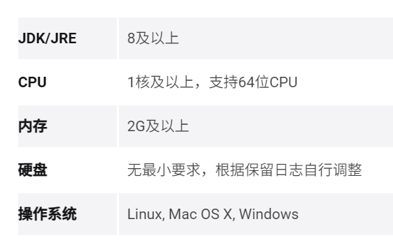

# 一、Nacos介绍

Nacos（Naming and Configuration Service）是一款阿里巴巴开源的动态服务发现、配置管理和服务管理平台。它提供了注册中心、配置中心和元数据管理等功能，帮助开发者轻松实现服务的注册、发现和配置管理。

本文介绍的所有代码存放位置：[./src/nacos/nacos.go]#(./src/nacos/nacos.go)

# 二、Nacos安装

1. 下载nacos

    ```shell
    https://nacos.io/download/nacos-server
    ```

2. 环境检查配置

    运行nacos的要求如下：

    - Java环境

        64 bit JDK 1.8+；

    - 环境要求

    

3. 单机环境运行（开发使用）

    ```shell
    startup.cmd -m standalone
    ```

4. nacos控制台页面

    浏览器打开http://127.0.0.1:8848/nacos,即可进入Nacos控制台页面。

# 三、Nacos 服务注册&发现

1. 引入包

    ```shell
    go get -u github.com/nacos-group/nacos-sdk-go/v2
    ```

2. 创建服务注册&发现客户端

    ```go
    package server

    import (
        "bytes"
        "encoding/json"
        "log"
        "strconv"
        "strings"

        "github.com/nacos-group/nacos-sdk-go/v2/clients"
        "github.com/nacos-group/nacos-sdk-go/v2/clients/config_client"
        "github.com/nacos-group/nacos-sdk-go/v2/clients/naming_client"
        "github.com/nacos-group/nacos-sdk-go/v2/common/constant"
        "github.com/nacos-group/nacos-sdk-go/v2/model"
        "github.com/nacos-group/nacos-sdk-go/v2/vo"
        "github.com/spf13/viper"
    )

    func getNacosServerUrl() []string {
        nacosUrlSclice := make([]string, 0)
        nacosUrl := viper.GetString("nacos.server")
        if strings.Contains(nacosUrl, ";") {
            nacosUrlSclice = strings.Split(nacosUrl, ";")
        } else {
            nacosUrlSclice = append(nacosUrlSclice, nacosUrl)
        }
        return nacosUrlSclice
    }

    func getNacosConfig() (constant.ClientConfig, []constant.ServerConfig) {
        // 创建clientConfig
        clientConfig := constant.ClientConfig{
            TimeoutMs:           5000,
            NotLoadCacheAtStart: true,
            LogDir:              "/tmp/nacos/log",
            CacheDir:            "/tmp/nacos/cache",
            LogLevel:            "warn",
        }

        // 至少一个ServerConfig
        serverConfigs := make([]constant.ServerConfig, 0)
        for _, addr := range getNacosServerUrl() {
            ipPort := strings.Split(addr, ":")
            if len(ipPort) != 2 {
                continue
            }
            port, _ := strconv.Atoi(ipPort[1])
            serverConfigs = append(serverConfigs, constant.ServerConfig{
                IpAddr:      ipPort[0],
                ContextPath: "/nacos",
                Port:        uint64(port),
            })
        }
        return clientConfig, serverConfigs
    }

    // GetNacosNamingClient 获取Nacos服务发现客户端
    func GetNacosNamingClient() (naming_client.INamingClient, error) {
        clientConfig, serverConfigs := getNacosConfig()
        // 创建服务发现客户端
        return clients.CreateNamingClient(map[string]interface{}{
            "serverConfigs": serverConfigs,
            "clientConfig":  clientConfig,
        })
    }
    ```

3. 注册服务至nacos

    ```go
    func RegisterService2Nacos(ip string, port uint64, endpoint string, metadata map[string]string) (bool, error) {
        client, err := GetNacosNamingClient()
        if err != nil {
            return false, err
        }

        return client.RegisterInstance(vo.RegisterInstanceParam{
            Ip:          ip,
            Port:        port,
            ServiceName: endpoint,
            Weight:      10,
            Enable:      true,
            Healthy:     true,
            Ephemeral:   true,
            Metadata:    metadata,
            GroupName:   endpoint,
        })
    }
    ```

4. 从nacos中注销服务

    ```go
    func UnRegisterService2Nacos(ip string, port uint64, endpoint string) (bool, error) {
        client, err := GetNacosNamingClient()
        if err != nil {
            return false, err
        }

        return client.DeregisterInstance(vo.DeregisterInstanceParam{
            Ip:          ip,
            Port:        port,
            ServiceName: endpoint,
            Ephemeral:   true,
            GroupName:   endpoint,
        })
    }
    ```

5. 从nacos中获取健康可用的服务


    ```go
    func GetServiceNacos(endpoint string) ([]model.Instance, error) {
        client, err := GetNacosNamingClient()
        if err != nil {
            return nil, err
        }
        return client.SelectInstances(vo.SelectInstancesParam{
            ServiceName: endpoint,
            GroupName:   endpoint,
            HealthyOnly: true,
        })
    }
    ```

6. 监听nacos中的服务

    ```go
    func SubscribeServiceNacos(endpoint string, callback func(services []model.Instance, err error)) error {
        client, err := GetNacosNamingClient()
        if err != nil {
            return err
        }
        param := &vo.SubscribeParam{
            ServiceName:       endpoint,
            GroupName:         endpoint,
            SubscribeCallback: callback,
        }
        return client.Subscribe(param)
    }
    ```

7. 取消监听nacos中的服务

    ```go
    func UnSubscribeServiceNacos(endpoint string, callback func(services []model.Instance, err error)) error {
        client, err := GetNacosNamingClient()
        if err != nil {
            return err
        }
        return client.Unsubscribe(&vo.SubscribeParam{
            ServiceName:       endpoint,
            GroupName:         endpoint,
            SubscribeCallback: callback,
        })
    }
    ```

# 四、Nacos 服务配置管理

1. 创建配置管理客户端

    ```go
    package server

    import (
        "bytes"
        "encoding/json"
        "log"
        "strconv"
        "strings"

        "github.com/nacos-group/nacos-sdk-go/v2/clients"
        "github.com/nacos-group/nacos-sdk-go/v2/clients/config_client"
        "github.com/nacos-group/nacos-sdk-go/v2/clients/naming_client"
        "github.com/nacos-group/nacos-sdk-go/v2/common/constant"
        "github.com/nacos-group/nacos-sdk-go/v2/model"
        "github.com/nacos-group/nacos-sdk-go/v2/vo"
        "github.com/spf13/viper"
    )

    func getNacosServerUrl() []string {
        nacosUrlSclice := make([]string, 0)
        nacosUrl := viper.GetString("nacos.server")
        if strings.Contains(nacosUrl, ";") {
            nacosUrlSclice = strings.Split(nacosUrl, ";")
        } else {
            nacosUrlSclice = append(nacosUrlSclice, nacosUrl)
        }
        return nacosUrlSclice
    }

    func getNacosConfig() (constant.ClientConfig, []constant.ServerConfig) {
        // 创建clientConfig
        clientConfig := constant.ClientConfig{
            TimeoutMs:           5000,
            NotLoadCacheAtStart: true,
            LogDir:              "/tmp/nacos/log",
            CacheDir:            "/tmp/nacos/cache",
            LogLevel:            "warn",
        }

        // 至少一个ServerConfig
        serverConfigs := make([]constant.ServerConfig, 0)
        for _, addr := range getNacosServerUrl() {
            ipPort := strings.Split(addr, ":")
            if len(ipPort) != 2 {
                continue
            }
            port, _ := strconv.Atoi(ipPort[1])
            serverConfigs = append(serverConfigs, constant.ServerConfig{
                IpAddr:      ipPort[0],
                ContextPath: "/nacos",
                Port:        uint64(port),
            })
        }
        return clientConfig, serverConfigs
    }

    // GetNacosConfigClient 获取Nacos动态配置客户端
    func GetNacosConfigClient() (config_client.IConfigClient, error) {
        clientConfig, serverConfigs := getNacosConfig()
        // 创建服务发现客户端
        return clients.CreateConfigClient(map[string]interface{}{
            "serverConfigs": serverConfigs,
            "clientConfig":  clientConfig,
        })
    }
    ```

2. 获取nacos中的配置

    ```go
    func GetConfigByNacos(endpoint string) (string, error) {
        client, err := GetNacosConfigClient()
        if err != nil {
            return "", err
        }
        content, err := client.GetConfig(vo.ConfigParam{
            DataId: endpoint,
            Group:  endpoint})
        return content, nil
    }
    ```

3. 发送配置文件至nacos

    ```go
    func PublicConfig2Nacos(endpoint string, metadata map[string]string) (bool, error) {
        client, err := GetNacosConfigClient()
        if err != nil {
            return false, err
        }
        dataBytes, err := json.Marshal(metadata)
        if err != nil {
            return false, err
        }
        return client.PublishConfig(vo.ConfigParam{
            DataId:  endpoint,
            Group:   endpoint,
            Content: string(dataBytes),
        })
    }
    ```

4. 删除nacos中的配置文件

    ```go
    func DeleteConfigByNacos(endpoint string) (bool, error) {
        client, err := GetNacosConfigClient()
        if err != nil {
            return false, err
        }
        return client.DeleteConfig(vo.ConfigParam{
            DataId: endpoint,
            Group:  endpoint,
        })
    }
    ```

5. 监听nacos中文件变化

    ```go
    func ListenConfigByNacos(endpoint string, callback func(namespace, group, dataId, data string)) error {
        client, err := GetNacosConfigClient()
        if err != nil {
            return err
        }
        return client.ListenConfig(vo.ConfigParam{
            DataId:   endpoint,
            Group:    endpoint,
            OnChange: callback,
        })
    }
    ```

6. 取消监听nacos中文件变化

    ```go
    func UnListenConfigByNacos(endpoint string) error {
        client, err := GetNacosConfigClient()
        if err != nil {
            return err
        }
        return client.CancelListenConfig(vo.ConfigParam{
            DataId: endpoint,
            Group:  endpoint,
        })
    }
    ```

# 五、Nacos服务配置监听更新demo

```go
func InitNacosDynamicConfig(endpoint string) {
    config, err := GetConfigByNacos(endpoint)
    if err != nil {
        log.Println("fetch remote config failed：", err.Error())
        panic(err)
    }
    err = viper.ReadConfig(bytes.NewBufferString(config))
    if err != nil {
        log.Println("parse remote config failed：", err.Error())
        panic(err)
    }

    err = ListenConfigByNacos(endpoint, func(namespace, group, dataId, data string) {
        log.Printf("listen config change: namespace: %s, group: %s, dataId: %s, data: \n%s\n", namespace, group, dataId, data)
        err := viper.ReadConfig(bytes.NewBufferString(data))
        if err != nil {
            log.Println("parse remote new config failed：", err.Error())
            panic(err)
        }
    })
    if err != nil {
        log.Println("listen remote config failed：", err.Error())
        panic(err)
    }
}
```