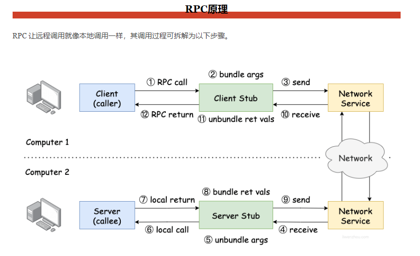

### rpc 远程过程调用

#### 一、介绍



① 服务调用方（client）以本地调用方式调用服务；

② client stub接收到调用后负责将方法、参数等组装成能够进行网络传输的消息体；

③ client stub找到服务地址，并将消息发送到服务端；

④ server 端接收到消息；

⑤ server stub收到消息后进行解码；

⑥ server stub根据解码结果调用本地的服务；

⑦ 本地服务执行并将结果返回给server stub；

⑧ server stub将返回结果打包成能够进行网络传输的消息体；

⑨ 按地址将消息发送至调用方；

⑩ client 端接收到消息；

⑪ client stub收到消息并进行解码；

⑫ 调用方得到最终结果。


#### 二、go 原生rpc框架使用

1. 基于http协议的rpc调用

    ```go
    // server端
    // GolangDocs/src/rpc/http_method/server/server.go
    package main

    import (
        "log"
        "net"
        "net/rpc"
    )

    /*
    定义一个serviceA 给其他client调用
    */
    // 定义参数
    type Args struct {
        X, Y int
    }

    // serviceA 服务
    type ServiceA struct{}

    // 自定义方法 要求 func(x interface, reply *ponit) error
    func (s *ServiceA) Add(args *Args, reply *int) error {
        // reply 必须是一个指针
        *reply = args.X + args.Y
        return nil
    }

    // rpc 包默认使用的是gob协议对传输数据进行序列化/反序列化
    func main() {
        service := new(ServiceA)
        // 注册RPC服务
        rpc.Register(service)

        // 设置RPC协议
        rpc.HandleHTTP() // 基于http协议
        listen, err := net.Listen("tcp", ":9000")
        if err != nil {
            log.Fatal(err)
        }
        http.Serve(listen, nil)
    }
    ```

    ```go
    // client端
    // GolangDocs/src/rpc/http_method/client/client.go
    package main

    import (
        "fmt"
        "log"
        "net"
        "net/rpc"
    )

    /*
    定义一个serviceA 给其他client调用
    */
    // 定义参数
    type Args struct {
        X, Y int
    }

    func main() {
        // 建立HTTP连接
        client, err := rpc.DialHTTP("tcp", "127.0.0.1:9000")

        // 同步调用
        args := &Args{10, 20}
        var reply int
        err = client.Call("ServiceA.Add", args, &reply)
        if err != nil {
            log.Fatal("ServiceA.Add error:", err)
        }
        fmt.Printf("ServiceA.Add: %d+%d=%d\n", args.X, args.Y, reply)

        // 异步调用
        var reply2 int
        divCall := client.Go("ServiceA.Add", args, &reply2, nil)
        replyCall := <-divCall.Done // 接收调用结果
        fmt.Println(replyCall.Error)
        fmt.Println(reply2)
    }
    ```

2. 基于tcp协议的rpc调用

    ```go
    // server端
    // GolangDocs/src/rpc/tcp_method/server/server.go
    package main

    import (
        "log"
        "net"
        "net/rpc"
    )

    /*
    定义一个serviceA 给其他client调用
    */
    // 定义参数
    type Args struct {
        X, Y int
    }

    // serviceA 服务
    type ServiceA struct{}

    // 自定义方法 要求 func(x interface, reply *ponit) error
    func (s *ServiceA) Add(args *Args, reply *int) error {
        // reply 必须是一个指针
        *reply = args.X + args.Y
        return nil
    }

    // rpc 包默认使用的是gob协议对传输数据进行序列化/反序列化
    func main() {
        service := new(ServiceA)
        // 注册RPC服务
        rpc.Register(service)

        listen, err := net.Listen("tcp", ":9000")
        if err != nil {
            log.Fatal(err)
        }
        for {
            conn, _ := listen.Accept()
            // 使用golang原始的gob协议
            rpc.ServeConn(conn)
        }
    }
    ```

    ```go
    // client端
    // GolangDocs/src/rpc/tcp_method/client/client.go
    package main

    import (
        "fmt"
        "log"
        "net"
        "net/rpc"
    )

    /*
    定义一个serviceA 给其他client调用
    */
    // 定义参数
    type Args struct {
        X, Y int
    }

    func main() {
        // 建立tcp连接
        client, err := rpc.Dial("tcp", "127.0.0.1:9000")
        if err != nil {
            log.Fatal(err)
        }

        // 同步调用
        args := &Args{10, 20}
        var reply int
        err = client.Call("ServiceA.Add", args, &reply)
        if err != nil {
            log.Fatal("ServiceA.Add error:", err)
        }
        fmt.Printf("ServiceA.Add: %d+%d=%d\n", args.X, args.Y, reply)

        // 异步调用
        var reply2 int
        divCall := client.Go("ServiceA.Add", args, &reply2, nil)
        replyCall := <-divCall.Done // 接收调用结果
        fmt.Println(replyCall.Error)
        fmt.Println(reply2)
    }
    ```

3. 使用json进行数据序列化/反序列化

    ```go
    // server端
    // GolangDocs/src/rpc/tcp_method_with_json/server/server.go
    package main

    import (
        "log"
        "net"
        "net/rpc"
        "net/rpc/jsonrpc"
    )

    /*
    定义一个serviceA 给其他client调用
    */
    // 定义参数
    type Args struct {
        X, Y int
    }

    // serviceA 服务
    type ServiceA struct{}

    // 自定义方法 要求 func(x interface, reply *ponit) error
    func (s *ServiceA) Add(args *Args, reply *int) error {
        // reply 必须是一个指针
        *reply = args.X + args.Y
        return nil
    }

    // rpc 包默认使用的是gob协议对传输数据进行序列化/反序列化
    func main() {
        service := new(ServiceA)
        // 注册RPC服务
        rpc.Register(service)

        // 设置RPC协议
        listen, err := net.Listen("tcp", ":9000")
        if err != nil {
            log.Fatal(err)
        }
        for {
            conn, _ := listen.Accept()
            // 使用golang原始的gob协议
            // rpc.ServeConn(conn)

            // 使用JSON协议
            rpc.ServeCodec(jsonrpc.NewServerCodec(conn))
        }
    }
    ```

    ```go
    // client端
    // GolangDocs/src/rpc/tcp_method_with_json/client/client.go
    package main

    import (
        "fmt"
        "log"
        "net"
        "net/rpc"
        "net/rpc/jsonrpc"
    )

    /*
    定义一个serviceA 给其他client调用
    */
    // 定义参数
    type Args struct {
        X, Y int
    }

    func main() {
        // 使用JSON协议
        // 建立tcp连接
        conn, err := net.Dial("tcp", "127.0.0.1:9000")
        if err != nil {
            log.Fatal(err)
        }
        client := rpc.NewClientWithCodec(jsonrpc.NewClientCodec(conn))

        // 同步调用
        args := &Args{10, 20}
        var reply int
        err = client.Call("ServiceA.Add", args, &reply)
        if err != nil {
            log.Fatal("ServiceA.Add error:", err)
        }
        fmt.Printf("ServiceA.Add: %d+%d=%d\n", args.X, args.Y, reply)

        // 异步调用
        var reply2 int
        divCall := client.Go("ServiceA.Add", args, &reply2, nil)
        replyCall := <-divCall.Done // 接收调用结果
        fmt.Println(replyCall.Error)
        fmt.Println(reply2)
    }
    ```

    ```python
    # python client 调用
    # GolangDocs/src/rpc/tcp_method_with_json/client/client.py
    import socket
    import json

    request = {
        "id": 0,
        "params": [{"x":10, "y":50}],  # 参数要对应上Args结构体
        "method": "ServiceA.Add"
    }

    client = socket.create_connection(("127.0.0.1", 9000),5)
    client.sendall(json.dumps(request).encode())

    rsp = client.recv(1024)
    rsp = json.loads(rsp.decode())
    print(rsp)
    ```

