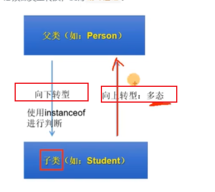
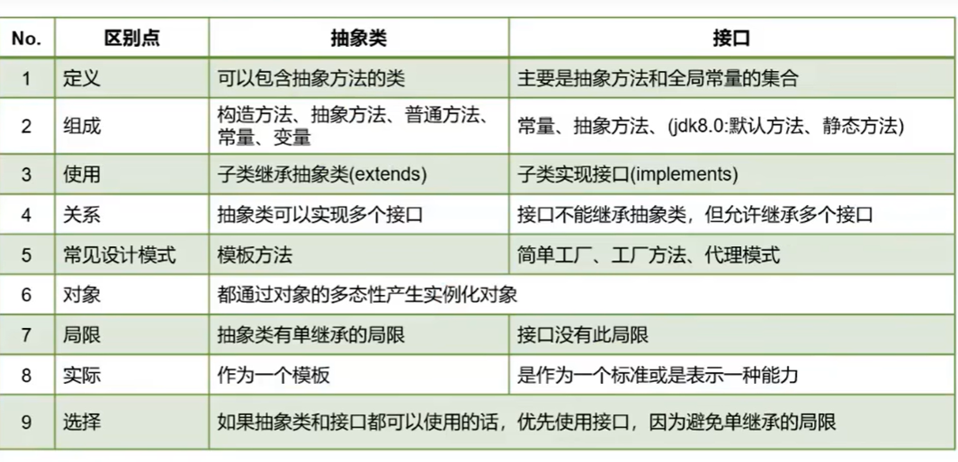

1. 面向对象基础代码

    ```java
    // Phone.java
    package chapter05.oop1;

    public class Phone {

        // 属性
        String name;// 品牌
        double price;// 价格

        // 方法
        public void call() {
            System.out.println("打电话");
        }

        public void sendMsg(String msg) {
            System.out.println("发送消息结果为：" + msg);
        }
    }

    // PhoneTest.java
    package chapter05.oop1;

    public class PhoneTest {
        public static void main(String[] args) {
            // 创建Phone对象
            Phone phone = new Phone();
            phone.call();
            phone.sendMsg("hello");
        }
    }
    ```

2. 面向对象说明

    ```java
    1. Java类中，创建一个对象，对象将被保存至栈中，而对象信息将会被保存在堆中，由栈中的对象指向堆中的对象信息

    2. 属性：声明在类中，方法之外；局部变量：声明在方法、构造器内的变量

    属性存在堆中，局部变量存在栈中
    属性在整个类的内部都有效，局部变量只能在声明的方法、构造器中使用
    属性可以使用权限修饰符，局部变量不可以使用修饰符
    属性都有默认值，局部便利都没有默认初始值
    ```

3. 方法的重载

    方法的重载与形参的名、权限修饰符、返回值没有关系；
    方法的重载与方法名、参数列表有关，方法名相同，且形参列表不相同

    ```java
    public class overloadTest {
        public void add(int i, int j) {
            System.out.println(i + j);
        }

        public void add(String i, String j) {
            System.out.println(i + j);

        }

        public static void main(String[] args) {
            overloadTest o = new overloadTest();
            o.add(10, 30);
            o.add("hello", "world");
        }
    }
    ```

4. 可变个数的形参

    可变参的本质就是传递一个数组引用

    ```java
    public class ArgsTest {
        public void pprint01(int ... num) {
            System.out.println(num);
        }

        public void pprint02(double[] num) {
            System.out.println(num);
        }

        public static void main(String[] args) {
            ArgsTest a= new ArgsTest();
            a.pprint01(1,2,3,4,5);
            double[] b = new double[]{12.1,  121.2, 1.1};
            a.pprint02(b);
        }
    }
    ```

5. java权限修饰符

    

6. java构造器（constructor）

    在没有明确定义构造器时，系统会自动分配一个构造器

    Java中类在进行实例化时，将走构造方法，类似于python中的__init__方法，需要注意的是，Java中走类的初始化时是先走父类的构造函数，然后走子类的构造函数，即使你的子类中定义了构造函数

    子类继承父类时，不会继承父类的构造器;子类实例化时，会直接或间接的调用父类的构造器

    ```java
    public class People {
        String name;
        byte age;

        // 定义构造器
        public People() {
        }

        // 构造器重载
        public People(byte a) {
            age = a;
        }

        public void eat(String str) {
            System.out.println("吃" + str);
        }

        public static void main(String[] args) {
            People p1 = new People((byte)(1));
            System.out.println(p1.age);
            p1.eat("面包干");
            People p2 = new People();
            System.out.println(p2.age);
        }
    }
    ```

7. this 代指当前对象，类似python中的self

    this调用构造器：格式"this(形参列表)"，调用当前类中指定的构造器，必须在当前构造器的首行。

    ```java
    public class User {
        private String name;
        private int age;

        public User() {
        }

        public User(String name) {
            this.name = name;
        }

        public User(String name, int age) {
            this(name);// 调用User(String name)构造器
            this.age = age;
        }

        public String getName() {
            return name;
        }

        public void setName(String name) {
            this.name = name;
        }

        public int getAge() {
            return age;
        }

        public void setAge(int age) {
            this.age = age;
        }

    }
    ```

    练习：银行-用户-账户关系
    chapter05->oop7

8. 继承

    extends

    重写 override规则
    1. 父类被子类重写的方法名和形参列表必须一致；
    2. 子类重写的权限修饰符不可以小于父类的，同时父类的private不可以被重写；
    3. 没有返回值的，重写的也必须没有返回值；有返回值的，返回基础类型的必须和父类一致，返回引用类型的可以与父类返回类型相同，或者是被重写的返回值的子类
    4. 静态方法不能被重写

    ```java
    public class Person {
        private String name;
        private int age;

        public Person() {

        }

        public Person(String name, int age) {
            this.name = name;
            this.age = age;
        }

        public String getName() {
            return name;
        }

        public void setName(String name) {
            this.name = name;
        }

        public int getAge() {
            return age;
        }

        public void setAge(int age) {
            this.age = age;
        }

        public String showInfo() {
            return "user:" + this.name + ",age:" + this.age;
        }
    }

    public class Student extends Person {
        public Student(String name, int age) {
            super(name, age);
        }

        @Override
        public String showInfo() {
            return "我在重写父类的方法";
        }

        public static void main(String[] args) {
            Student s = new Student("张三", 20);
            System.out.println(s.showInfo());
        }
    }
    ```

9. 多态性

    
    父类的引用指向子类的对象；
    针对方法：编译看左边，运行看右边；
    针对属性：看当前的编译类型；

    向下转型可能出现类型转换异常，建议使用instanceof判断一下

    ```java
    public class Person {
        public void say(String msg) {
            System.out.println("person say" + msg);
        }

        public void eat() {
            System.out.println("person eat");
        }
    }

    class Man extends Person {
        public void say(String msg) {
            System.out.println("man say" + msg);
        }

        public void eat() {
            System.out.println("man eat");
        }

        public void sleep() {
            System.out.println("man sleep");
        }
    }

    class Woman extends Person {
        public void say(String msg) {
            System.out.println("Woman say" + msg);
        }

        public void eat() {
            System.out.println("Woman eat");
        }

        public void watch() {
            System.out.println("woman watch");
        }
    }

    class Programmer {
        public void run(Person p) {
            p.say("hello world");
            p.eat();

            // 尝试 向下转型
            if (p instanceof Man) {
                // 判断当前类型是man类型，进行转换
                Man mp = (Man)p;
                mp.sleep();
            }

            if (p instanceof Woman){
                Woman wp = (Woman)p;
                wp.watch();
            }
        }
    }

    class PersonTest {
        public static void main(String[] args) {
            Programmer p = new Programmer();
            // p.run中调用的say、eat还是根据当前对象来进行调用的
            // 初始化Person类
            p.run(new Person());
            // 初始化Man类，其为Person的子类，
            // 故此处为向上转型
            p.run(new Man());
            // 初始化Woman类，其为Person的子类，
            // 故此处为向上转型
            p.run(new Woman());
        }
    }
    ```

10. Object类

    - finalize方法：当GC要回收此对象时，将执行此方法

    - equals方法：
        任何引用类型都可以使用
        ==是判断当前对象所在栈地址是否相等，equals则是判断当前对象所在堆内容是否一致
    
    - toString方法：
        类比python中的__str__方法

    ```java
    public class equalTest {
        String name;
        int age;

        public equalTest(String name, int age) {
            this.name = name;
            this.age = age;
        }

        // 重写equals后 两个对象比较
        @Override
        public boolean equals(Object obj) {
            if (this == obj) {
                return true;
            }

            if (obj instanceof equalTest) {
                equalTest objE = (equalTest) obj;
                return this.age == objE.age;
            }

            return false;
        }
    }

    class Main {
        public static void main(String[] args) {
            equalTest e1 = new equalTest("张三", 10);
            equalTest e2 = new equalTest("李四", 10);
            // Object equals方法比较e1 e2栈地址
            // 重写equals方法，比较两个对象的值
            boolean x = e1.equals(e2);
            System.out.println("e1 == e2 ?" + x);
        }
    }
    ```

11. static关键字

    Java类中，static变量（方法）是静态变量（方法），类似于python中的类属性和类方法；在Java中，可以直接使用类名调用；java中的static关键字主要用于内存管理。我们可以应用java static关键字在变量，方法，块和嵌套类中。 static关键字属于类，而不是类的实例；

    static 实现单例模式

    饿汉式，此种单例会伴随类的出现而出现，类的消亡而消亡，线程安全
    ```java
    class Bank {

        // 构造器私有化，禁止被new出来
        private Bank() {
        }

        private static Bank Instance = new Bank();

        // 通过静态方法返回当前对象
        public static Bank getBank() {
            return Instance;
        }
    }

    public class BankTest {
        public static void main(String[] args) {
            Bank b1 = Bank.getBank();
            Bank b2 = Bank.getBank();
            System.out.println(b1 == b2);
        }
    }
    ```

    懒汉式，此种单例会伴随对象的创建而分配，可能存在线程安全问题
    ```java
    class Bank {
        private Bank() {
        }

        private static Bank Instance = null;

        public static Bank getBank() {
            if (Instance == null) {
                Instance = new Bank();
            }
            return Instance;
        }
    }

    public class BankTest02 {
        public static void main(String[] args) {
            Bank b1 = Bank.getBank();
            Bank b2 = Bank.getBank();
            System.out.println(b1 == b2);
        }
    }
    ```

12. 代码块

    执行先后顺序：
        静态代码块 -> 非静态代码块

    静态代码块：
        随着类的加载而执行；
        可以用来初始化类的信息;
        只能调用静态的属性、方法

    非静态代码块：
        随这对象的创建而执行；
        可以用来初始化对象的信息；
        可以调用静态的属性、方法，也可以调用非静态的属性、方法

    ```java
    class Bank {

        // 非静态代码块
        {
            System.out.println("我是非静态代码块");
        }

        // 静态代码块
        static {
            System.out.println("我是静态代码块");
        }
    }

    public class staticTest {
        public static void main(String[] args) {
            Bank b = new Bank();
            System.out.println(b);
        }
    }
    ```

13. 类加载顺序

    静态代码块->代码块->构造器初始化

    

    对于继承的对象，应该是由父及子，静态先行


14. final关键字 - 修饰 变量 方法 类

    - final修饰的类 不可以被继承

    - final修饰的方法 不可以被重写

    - final修饰的变量 此时的变量就变成了常量 不可以修改
        - 成员变量
            - 只能显示赋值
            - 代码块中赋值
            - 构造器中赋值


15. abstract 抽象类  不能实例化对象

    抽象类不能够实例化

    抽象类中 加入abstract即可
    抽象方法中 加入abstract即可

    子类必须重写父类所有的抽象方法后，才能创建对象

    不可以使用abstract修饰private方法、静态方法、final方法、final修饰的类

    ```java
    // 加上abstract 就变成了一个抽象类
    public abstract class Person {
        // 抽象方法 可以没有方法体
        public abstract void eat();
    }

    public class Man extends Person {
        @Override
        public void eat() {
            System.out.println("男人吃饭");
        }

        public static void main(String[] args) {
            Man man = new Man();
            man.eat();
        }
    }
    ```

16. 接口 interface 不能实例化对象 可多继承

    接口里面的属性是全局类型的常量，即别的类可以直接用接口名就可以访问里面的属性了，接口里面的所有方法都是抽象方法，没有方法体；和抽象类不同的是接口里面的抽象方法不需要加 abstract 关键字

    接口的多态性
    接口名 变量名 = new 实现类对象;

    类和类之间是继承关系，类和接口之间是实现关系，接口和接口之间是多继承关系

    jdk8之后的特性
    接口中可以声明静态方法，此静态方法只能被接口调用，不能被实现类调用

    接口中实现的默认方法，可以被实现类继承，当然也可以被实现类重写

    接口冲突：类实现了两个及以上的接口，但有两个接口定义了同名同参数的默认方法，而刚好实现类没有重写此两个接口的方法，就会报错

    

    ```java
    // 接口
    interface Usb {
        // 接口方法
        public abstract void comin();

        // 接口方法
        public abstract void comout();
    }

    // 接口的继承
    interface UsbA extends Usb {
        public abstract String getUsbA();
    }

    // 接口的继承
    interface UsbB extends Usb {
        public abstract String getUsbB();
    }

    // 接口的继承
    interface UsbC extends Usb {
        public abstract String getUsbC();
    }

    // 接口的多继承
    interface SuperUsb extends UsbA, UsbB, UsbC {

    }

    // 实现UsbA的接口
    class Phone implements UsbA {

        @Override
        public void comin() {
            System.out.println("我是手机，插入了USB");
        }

        @Override
        public void comout() {
            System.out.println("我是手机，弹出了USB");
        }

        @Override
        public String getUsbA() {
            return "Phone A";
        }

    }

    // 继承Phone类，实现UsbC接口
    class SmartPhone extends Phone implements UsbC {

        @Override
        public String getUsbC() {
            return "SmartPhone C";
        }

    }

    class Computer {
        public void link(Usb usb) {
            System.out.println("---连接电脑中----");
            usb.comin();
            usb.comout();
            System.out.println("----断开电脑连接----");
        }
    }

    public class InterfaceTest {
        public static void main(String[] args) {
            Phone p = new Phone();
            p.comin();
            p.comout();

            SmartPhone p2 = new SmartPhone();
            p2.comin();
            p2.comout();
            System.out.println(p2.getUsbA());
            System.out.println(p2.getUsbC());

            // 接口的多态性
            UsbA p3 = new Phone();
            System.out.println(p3.getUsbA());

            Computer c = new Computer();
            c.link(p);
            c.link(p2);
        }
    }
    ```

17. 匿名类的操作  认为是当前类的的子类实现

    ```java
    public class ClassTest{
        public static void main(String[] args) {
            // 创建一个匿名对象
            // 通过这种方式，其实是创建的Object的子类，并实现了一个show方法
            // 由于是匿名类，没有名称，故调用可以直接在创建的对象上调用
            new Object(){
                public void show(){
                    System.out.println("我是show方法");
                }
            }.show();
        }
    }
    ```

18. 枚举类

    ```java
    // 枚举类的定义方法
    enum Score {
        A("优秀", 90),
        B("良好", 80),
        C("及格", 60);

        // 配置当前枚举对象中包含的字段
        private final String desc;
        private final int code;

        public String getDesc() {
            return desc;
        }

        public int getCode() {
            return code;
        }

        // 私有化构造器
        private Score(String desc, int code) {
            this.desc = desc;
            this.code = code;
        }
    }

    public class enumTest {
        public static void main(String[] args) {
            System.out.println(Score.A);
            System.out.println(Score.A.getDesc());

            // valueof 返回当前枚举类的对象
            Score x = Score.valueOf("A");
            System.out.println(x.getDesc() + x.getCode());

            // values返回枚举类型的数组
            Score[] xx = Score.values();
            for (int i = 0; i < xx.length; i++) {
                System.out.println(xx[i].getDesc() + xx[i].getCode());
            }
        }
    }
    ```

19. 包装类

    ```java
    public class WrapperTest {
        public static void main(String[] args) {
            // 包装类的自动装箱 拆箱

            // 装箱
            Integer a = 5;
            System.out.println(a + "<>" + a.intValue());
            // 拆箱
            int b = a;
            System.out.println(b);

            // 包装类列举
            // Boolean -> boolean
            // Character->char
            // Byte -> byte
            // Short -> short
            // Integer -> int
            // Long -> long
            // Float -> float
            // Double -> double
            System.out.println(Byte.MAX_VALUE);
        }
    }
    ```

    基本类型、包装类->String 使用 String.valueOf(xxx)方法

    String->基本数据类型  使用包装类的parsexxx方法
