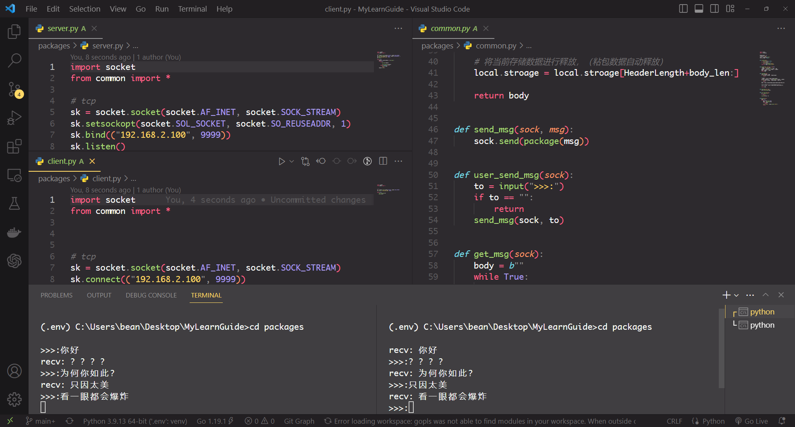

1. TCP通信

    参考demo如下：
    
    - [基于Socket的TCP协议实现]#(NetworkDocs/基于Socket的TCP协议实现.md)

    - [手搓HTTP制作短链接生成器]#(GolangDocs/Golang-手搓HTTP制作短链接生成器.md)


2. 存在的问题

    TCP是面向流，没有边界，而操作系统在发送TCP数据时，会通过缓冲区来进行优化，例如缓冲区为1024个字节大小。如果一次请求发送的数据量比较小，没达到缓冲区大小，TCP则会将多个请求合并为同一个请求进行发送，会发生粘包问题。如果一次请求发送的数据量比较大，超过了缓冲区大小，TCP就会将其拆分为多次发送，会发生拆包问题。

3. 优化措施

    将消息分为头部、消息体两个部分，头部保留消息的长度，这样在读取足够的长度后在对读到的数据进行解析，使得得到一个完整的消息。

4. 相关代码

    - 结合[3](#3)的描述，我们将得到如下这部分代码

        ```python
        import struct
        import threading


        HeaderLength = 12   # 设置消息头长度
        __format = "!3I"    # 使用struct对消息头进行打包，"!3I"表示打包数据的字节顺序--->网络(=大端)，同时长度为3个无符号的整数，刚好对应的长度为3*4(int占用4个字节)=12字节  详情请参考:https://docs.python.org/zh-cn/3/library/struct.html
        local = threading.local()   # 初始化local对象，对于多线程的数据保存起到隔离作用
        local.stroage = bytes()


        def to_bytes(msg):
            if isinstance(msg, bytes):
                return msg
            if isinstance(msg, str):
                return msg.encode("utf-8")
            return str(msg).encode("utf-8")


        # 数据发送时，进行封包，即数据封装为请求头、请求体两部分，请求头部分保留请求体的数据长度(有点像简化版本的HTTP协议)
        def package(msg, version=1, cmd=100):
            __body = to_bytes(msg)
            __header = [version, len(__body), cmd]
            header = struct.pack(__format, *__header)
            body = header + __body
            return body

        # 数据获取时，进行解包
        # 1. 我们将获取到的数据全部写入到local.stroage这个对象中，同时需要判断当前获取的数据长度是否超过请求头的长度，如果没有，需要继续获取数据
        # 2. 在获取大于请求头的长度的数据后，我们对请求头进行解析，确认请求体的数据具体大小
        # 3. 确认此刻获取的总数据大小是否达到了 请求头的长度+请求体的长度，如若没有，需要继续获取数据
        # 4. 在上一步的基础上，若是获取的总数据确实达到了要求，此刻解析请求体的数据
        # 5. 通过上述步骤即可对粘包的数据进行分割出来，当然，即使是被分包的数据，我们也会在第三步要求他继续获取数据，这样分包的数据也不会丢失。
        # 6. 最后将获取的数据取出，同时清理原存储数据的变量，让它能够释放旧数据。
        def unpackage(msg):
            local.stroage += msg
            if len(local.stroage) < HeaderLength:
                return

            # 解析头
            __header = local.stroage[:HeaderLength]
            version, body_len, _ = struct.unpack(__format, __header)
            if len(local.stroage) < HeaderLength + body_len:
                return
            # 获取body
            body = local.stroage[HeaderLength:HeaderLength+body_len]

            # 将当前存储数据进行释放，（粘包数据自动释放）
            local.stroage = local.stroage[HeaderLength+body_len:]

            return body
        ```

    - 有了对消息打包，解包的代码后，我们改写我们的tcp server端和client端，相关代码如下(存储地址：NetworkDocs/src/TCP/package)：

        ```python
        # common代码
        import struct
        import threading


        HeaderLength = 12
        __format = "!3I"
        local = threading.local()
        local.stroage = bytes()


        def to_bytes(msg):
            if isinstance(msg, bytes):
                return msg
            if isinstance(msg, str):
                return msg.encode("utf-8")
            return str(msg).encode("utf-8")


        def package(msg, version=1, cmd=100):
            __body = to_bytes(msg)
            __header = [version, len(__body), cmd]
            header = struct.pack(__format, *__header)
            body = header + __body
            return body


        def unpackage(msg):
            local.stroage += msg
            if len(local.stroage) < HeaderLength:
                return

            # 解析头
            __header = local.stroage[:HeaderLength]
            version, body_len, _ = struct.unpack(__format, __header)
            if len(local.stroage) < HeaderLength + body_len:
                return
            # 获取body
            body = local.stroage[HeaderLength:HeaderLength+body_len]

            # 将当前存储数据进行释放，（粘包数据自动释放）
            local.stroage = local.stroage[HeaderLength+body_len:]

            return body


        def send_msg(sock, msg):
            sock.send(package(msg))


        def user_send_msg(sock):
            to = input(">>>:")
            if to == "":
                return
            send_msg(sock, to)


        def get_msg(sock):
            body = b""
            while True:
                msg = sock.recv(1024)
                body = unpackage(msg)
                if not body:
                    return
                print("recv:", body.decode("utf-8"))
                return
        ```

        ```python
        # server端
        import socket
        from common import *

        # tcp
        sk = socket.socket(socket.AF_INET, socket.SOCK_STREAM)
        sk.setsockopt(socket.SOL_SOCKET, socket.SO_REUSEADDR, 1)
        sk.bind(("192.168.2.100", 9999))
        sk.listen()

        while True:
            request, client_address = sk.accept()
            while True:
                try:
                    get_msg(request)
                    
                    user_send_msg(request)
                except Exception as e:
                    print(e.args)
                    break
            request.close()
        ```

        ```python
        # client端
        import socket
        from common import *


        # tcp
        sk = socket.socket(socket.AF_INET, socket.SOCK_STREAM)
        sk.connect(("192.168.2.100", 9999))

        while True:
            user_send_msg(sk)
            get_msg(sk)
        ```

5. 运行截图

    