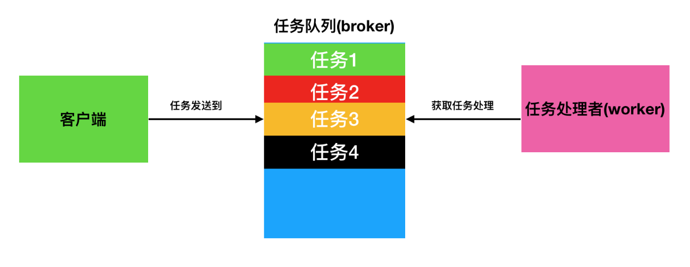

### 一、简介

[celery](https://github.com/celery/celery)，什么？芹菜？难不成是这个？


哈哈哈哈，开个玩笑~ ，Celery 分布式任务队列

Celery 是一款非常简单、灵活、可靠的分布式系统，可用于处理大量消息，并且提供了一整套操作此系统的一系列工具。同时也是一款消息队列工具，可用于处理实时数据以及任务调度。


### 二、 使用介绍

1. 官方文档
   - [https://docs.celeryproject.org](https://docs.celeryproject.org/en/stable/)
2. 中文文档-暂时停更
   - [https://www.celerycn.io/v/4.4.0/](https://www.celerycn.io/v/4.4.0/)

3. 工作流程

   

   4. 安装

      `pip install -U celery`


### 三、快速入门

1. 文件目录树

   ```shell
   ├── app.py	# 启动任务
   └── celery_app
       ├── __init__.py	# celery启动文件
       ├── conf.py	# celery配置文件
       └── tasks # celery任务文件
           ├── __init__.py
           ├── task1.py
           └── task2.py
   ```

   

2. 配置文件

   ```python
   from datetime import timedelta
   from celery.schedules import crontab
   
   broker_url = "redis://192.168.1.102/1"
   result_backend = "redis://192.168.1.102/2"
   
   # 任务事件
   # 两种均可
   
   # 1. 导入
   imports = (
       "celery_app.tasks.task1",
       "celery_app.tasks.task2",
   )
   # 2. 自动查询任务
   # app.autodiscover_tasks(['celery_app'])
   
   
   # 定时任务&设置时区
   # 时区
   timezone = "Asia/Shanghai"
   # 定时
   beat_schedule = {
       # 第一个任务
       "task1": {
           # 任务明细
           "task": "celery_app.tasks.task1.send",
           # 时间间隔
           "schedule": timedelta(minutes=10),
           # 参数
           "args": ("hello celery",)
       },
       "task2": {
           # 任务明细
           "task": "celery_app.tasks.task2.add",
           # 具体时间
           "schedule": crontab(hour=0, minute=0),
           # 参数
           "args": (10, 20)
       }
   }
   ```

   

3. 启动文件

   ```python
   from celery import Celery
   
   app = Celery("demo")
   app.config_from_object("celery_app.conf")
   # 自动查询任务
   # app.autodiscover_tasks(['celery_app'])
   ```

   

4. 任务文件

   ```python
   # task1.py
   from celery_app import app
   
   
   @app.task()
   def send(msg: str) -> bool:
       import time
       time.sleep(3)
       print("发送消息--{}--成功~".format(msg))
       return True
     
     
   # task2.py
   from celery_app import app
   
   
   @app.task()
   def add(a: int, b: int) -> int:
       import time
       time.sleep(3)
       print("add--{}--成功~".format(a + b))
       return a + b
   ```

   

5. 启动任务

   ```python
   from celery_app.tasks import task1
   from celery_app.tasks import task2
   
   r1 = task1.send.delay("safads")
   r2 = task2.add.delay(23, 2)
   print("end ...")
   ```


6. 启动命令

   非定时任务启动方式`celery -A celery_app worker -l info`

   含定时任务启动方式`celery -A celery_app worker -B -l info`

