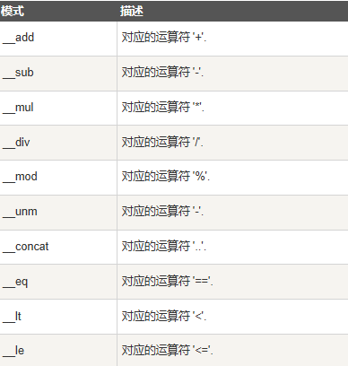
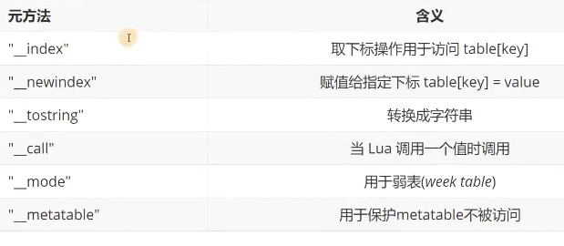
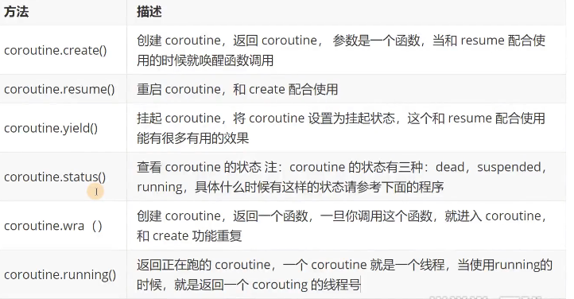

1. 环境安装

    ```shell
    # 安装lua
    # 安装vscode
    # 安装vscode插件
    # Lua Helper
    ```


2. hello world

    ```lua
    print("hello world")
    ```

3. 注释

    ```lua
    -- 这是单行注释

    --[[
        我是多行注释1
        我是多行注释2
    --]]
    ```

4. 关键词

    |||||
    |---|---|---|---|
    |and|break|do|else|
    |elseif|end|false|for|
    |function|if|in|local|
    |nil|not|or|repeat|
    |return|then|true|until|
    |while|goto|||

5. 变量

    ```lua
    -- 默认情况下，变量总是全局的,访问没有初始化的变量也不会报错，得到的结果为nil

    -- 声明一个局部变量
    local msg = "这是一个局部变量"
    ```

6. 数据类型

    ```lua
    -- 通过type查看对象的数据类型

    nil         只有值nil属于该类，表示一个无效值（在条件表达式中相当于false）。
    boolean	    包含两个值：false和true。
    number	    表示双精度类型的实浮点数
    string	    字符串由一对双引号或单引号来表示
    function	由 C 或 Lua 编写的函数
    userdata	表示任意存储在变量中的C数据结构
    thread	    表示执行的独立线路，用于执行协同程序
    table	    Lua 中的表（table）其实是一个"关联数组"（associative arrays），数组的索引可以是数字、字符串或表类型。在 Lua 里，table 的创建是通过"构造表达式"来完成，最简单构造表达式是{}，用来创建一个空表。
    ```

7. 循环 

    - for循环
        ```lua
        -- 数组for循环
        --[[
        var 从 exp1 变化到 exp2，每次变化以 exp3 为步长递增 var，并执行一次 "执行体"。exp3 是可选的，如果不指定，默认为1。
        for var=exp1,exp2,exp3 do  
            <执行体>  
        end
        --]]
        for i = 1, 10, 1 do
            print(i)
        end

        -- 泛型for循环
        local a = {"one", "two", "three"}   -- 数组
        for idx, v in ipairs(a) do
            print(idx, v)
        end
        ```

    - while循环

        ```lua
        --[[
            while(condition)
            do
                statements
            end
        --]]
        local b = 10
        while (b > 0) do
            print(b)
            b = b - 1
        end
        ```

    - repeat until循环(类似于do...while语句)

        Lua 编程语言中 repeat...until 循环语句不同于 for 和 while循环，for 和 while 循环的条件语句在当前循环执行开始时判断，而 repeat...until 循环的条件语句在当前循环结束后判断。

        ```lua
        --[[
        repeat
        statements
        until( condition )
        --]]
        local a = 10
        repeat
            print("a value:", a)
            a = a - 1
        until a > 8
        ```

    - 嵌套循环案例

        ```lua
        for i = 1, 9, 1 do
            for j = 9, 1, -1 do
                print(i, "*", j, "=", i * j)
            end
        end
        ```

    - break

    - goto

        ```lua
        -- goto 需搭配label使用
        -- label写法 ::label::

        -- goto实现continue
        -- 大于3就直接continue
        for i=1,4 do
            if i > 3 then
                goto continue
            end
            print(i)
            ::continue::
        end
        ```

    - pairs & ipairs

        ```lua
            -- pairs 
                -- 既可以遍历数组形式的表，也可以遍历键值形式的表
                -- 如果遍历过程中遇到nil,则跳过此元素并继续遍历
            -- ipairs 
                -- 只能遍历数组形式的表
                -- 从索引1开始，遍历到nil时，停止遍历
        ```


8. 流程控制

    ```lua
    -- if语法
    local a = 10

    if a > 5 then
        print("a>5")
    end

    -- if else语法
    local a = 3
    if a > 5 then
        print("a>5")
    else
        print("a<5")
    end

    -- if elseif语法
    local a = 10
    if a > 8 then
        print("a>8")
    elseif a > 5 then
        print("a>5")
    else
        print("a<5")
    end
    ```

9. 运算符

    ```shell
    +	加法	A + B 输出结果 30
    -	减法	A - B 输出结果 -10
    *	乘法	A * B 输出结果 200
    /	除法	B / A 输出结果 2
    %	取余	B % A 输出结果 0
    ^	乘幂	A^2 输出结果 100
    -	负号	-A 输出结果 -10
    //	整除运算符(>=lua5.3)	5//2 输出结果 2


    ==	等于，检测两个值是否相等，相等返回 true，否则返回 false	(A == B) 为 false。
    ~=	不等于，检测两个值是否相等，不相等返回 true，否则返回 false	(A ~= B) 为 true。
    >	大于，如果左边的值大于右边的值，返回 true，否则返回 false	(A > B) 为 false。
    <	小于，如果左边的值大于右边的值，返回 false，否则返回 true	(A < B) 为 true。
    >=	大于等于，如果左边的值大于等于右边的值，返回 true，否则返回 false	(A >= B) 返回 false。
    <=	小于等于， 如果左边的值小于等于右边的值，返回 true，否则返回 false	(A <= B) 返回 true。


    and	逻辑与操作符。 若 A 为 false，则返回 A，否则返回 B。	(A and B) 为 false。
    or	逻辑或操作符。 若 A 为 true，则返回 A，否则返回 B。	(A or B) 为 true。
    not	逻辑非操作符。与逻辑运算结果相反，如果条件为 true，逻辑非为 false。	not(A and B) 为 true。


    ..	连接两个字符串	a..b ，其中 a 为 "Hello " ， b 为 "World", 输出结果为 "Hello World"。
    #	一元运算符，返回字符串或表的长度。	#"Hello" 返回 5
    ```

10. 字符串

    ```lua
    local a = '这是字符串'
    local b = "这是字符串"
    local c = [[这是字符串]]

    local myString = "Hello,世界!"

    -- 计算字符串的长度（字符个数）
    local length1 = utf8.len(myString)
    print(length1) -- 输出 9

    -- string.len 函数会导致结果不准确
    local length2 = string.len(myString)
    print(length2) -- 输出 13
    ```

11. 数组[table]数组的下标从1开始

    ```lua
    local a = {10, 23, 121, 111}
    -- for循环搭配ipairs直接遍历
    for key, value in ipairs(a) do
        print(key, value)
    end

    -- 使用#获取数组长度进行遍历
    for i=1,#a do
        print(a[i])
    end
    ```

12. 函数

    ```lua
    optional_function_scope function function_name( argument1, argument2, argument3..., argumentn)
        function_body
        return result_params_comma_separated
    end

    -- optional_function_scope: 该参数是可选的指定函数是全局函数还是局部函数，未设置该参数默认为全局函数，如果你需要设置函数为局部函数需要使用关键字 local。

    -- function_name: 指定函数名称。

    -- argument1, argument2, argument3..., argumentn: 函数参数，多个参数以逗号隔开，函数也可以不带参数。

    -- function_body: 函数体，函数中需要执行的代码语句块。

    -- result_params_comma_separated: 函数返回值，Lua语言函数可以返回多个值，每个值以逗号隔开。
    ```

    ```lua
    -- 定义一个斐波拉契数列函数
    local function fibo(n)
        if n < 2 then
            return n
        else
            return fibo(n - 1) + fibo(n - 2)
        end
    end


    for i = 1, 10, 1 do
        print("current: "..i.." fibo value: "..fibo(i))
    end
    ```

    ```lua
    -- 可变参数使用...表示，...解析如下
    local function Args(...)
        print("get args nums: ", #{ ... })
        local arg = { ... }
        print("get args nums: ", #arg)

        for index, value in ipairs({ ... }) do
            print(index, value)
        end
    end


    Args(10, 12, 14)
    ```

13. 元表（Metatable）

    Lua 提供了元表(Metatable)，允许我们改变 table 的行为
    
    setmetatable(table,metatable): 对指定 table 设置元表(metatable)，如果元表(metatable)中存在 __metatable 键值，setmetatable 会失败。
    
    getmetatable(table): 返回对象的元表(metatable)。

    
    

    ```lua
    -- 元表 测试 tostring方法
    local mytable_metatable = {}
    -- 为表设置元（类似python中的魔法方法）
    mytable_metatable.__tostring = function(t)
        local strs = ""
        for i, v in pairs(t) do
            -- 字符串拼接
            strs = strs .. i
            strs = strs .. v
        end
        return strs
    end

    -- 自定义一个表
    a = {4, 1, 3}
    -- 为自定义表绑定元表
    setmetatable(a, mytable_metatable)
    -- 尝试tostring方法
    print(a)
    ```

14. 模块

    Lua 的模块是由变量、函数等已知元素组成的 table，因此创建一个模块很简单，就是创建一个 table，然后把需要导出的常量、函数放入其中，最后返回这个 table 就行。以下为创建自定义模块 module.lua，文件代码格式如下：

    ```lua
    -- 文件名为 module.lua
    -- 定义一个名为 module 的模块
    module = {}
    
    -- 定义一个常量
    module.constant = "这是一个常量"
    
    -- 定义一个函数
    function module.func1()
        io.write("这是一个公有函数！\n")
    end
    
    local function func2()
        print("这是一个私有函数！")
    end
    
    function module.func3()
        func2()
    end
    
    return module
    ```

    引用lua `require`, 语法 `require("模块名称")`

    ```lua
    require("module")

    module.say("this is module")
    ```

15. 协程

    

16. 文件

    ```lua
    local file = io.open("utils.lua", "r")
    if file ~= nil then
        -- 读取文件首行
        print(file:read())
    end
    ```

17. 异常

    error函数

        error (message [, level])

        功能：终止正在执行的函数，并返回message的内容作为错误信息(error函数永远都不会返回)

        通常情况下，error会附加一些错误位置的信息到message头部。

        Level参数指示获得错误的位置:

        Level=1[默认]：为调用error位置(文件+行号)
        Level=2：指出哪个调用error的函数的函数
        Level=0:不添加错误位置信息

    pcall 函数

        Lua中处理错误，可以使用函数pcall（protected call）来包装需要执行的代码。

        pcall接收一个函数和要传递给后者的参数，并执行，执行结果：有错误、无错误；返回值true或者或false, errorinfo。

        语法格式如下

        if pcall(function_name, ….) then
        -- 没有错误
        else
        -- 一些错误
        end

18. 垃圾回收

    Lua 提供了以下函数collectgarbage ([opt [, arg]])用来控制自动内存管理:

    collectgarbage("collect"): 做一次完整的垃圾收集循环。通过参数 opt 它提供了一组不同的功能：

    collectgarbage("count"): 以 K 字节数为单位返回 Lua 使用的总内存数。 这个值有小数部分，所以只需要乘上 1024 就能得到 Lua 使用的准确字节数（除非溢出）。

    collectgarbage("restart"): 重启垃圾收集器的自动运行。

    collectgarbage("setpause"): 将 arg 设为收集器的 间歇率。 返回 间歇率 的前一个值。

    collectgarbage("setstepmul"): 返回 步进倍率 的前一个值。

    collectgarbage("step"): 单步运行垃圾收集器。 步长"大小"由 arg 控制。 传入 0 时，收集器步进（不可分割的）一步。 传入非 0 值， 收集器收集相当于 Lua 分配这些多（K 字节）内存的工作。 如果收集器结束一个循环将返回 true 。

    collectgarbage("stop"): 停止垃圾收集器的运行。 在调用重启前，收集器只会因显式的调用运行。

19. 面向对象

    ```lua
    local dog = {}
    local mt = {
        __index = dog
    }

    -- dog.eat(self) 可以简化为dog:eat()  其中self可以不写，在函数内部可以直接使用
    function dog.eat(self)
        print("dog eat", self)
    end

    function dog:sleep()
        print("dog sleep", self)
    end

    function dog.work()
        print("dog work")
    end

    function dog.new(self)
        -- 通过元表，将dog new出去
        return setmetatable(self, mt)
    end


    local mydog = dog:new()
    mydog:eat()
    -- 或者这样调用
    dog.eat(mydog)

    local mydog2 = dog.new(dog)
    mydog2:eat()
    -- 或者这样调用
    dog.eat(mydog2)


    -- : 面向对象的写法，会自动传入self
    -- . 非面向对象写法，需要手动传入self对象
    ```

